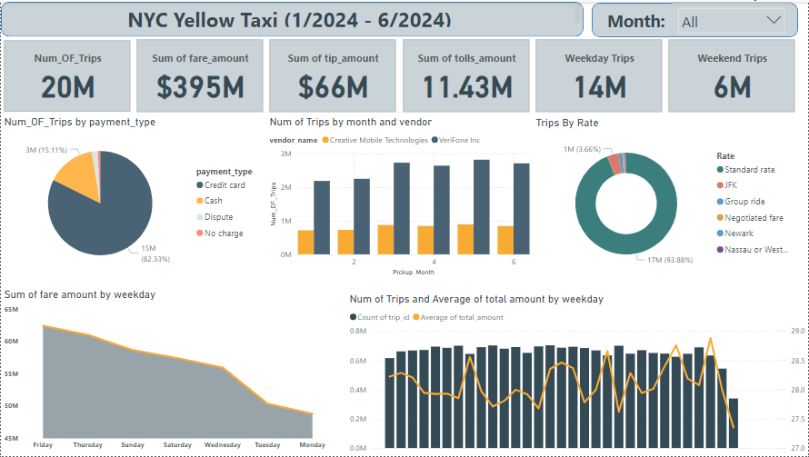

# Real-Time Data Pipeline for NYC Yellow Taxi Trips

## Project Overview

This project is designed to build a **real-time data pipeline** for processing and analyzing NYC Yellow Taxi trips data from **January 2024 to June 2024**. The dataset contains approximately **21 million rows**. The pipeline leverages streaming and batch processing technologies to ingest, process, transform, and store the data for analytical use.

The pipeline is implemented using:
- **Python** for data downloading and Kafka production.
- **Apache Kafka** for real-time data ingestion.
- **Spark Streaming** for consuming and processing data.
- **MySQL** for storing raw data as a staging layer.
- **PySpark** for data cleaning, transformation, and normalization.
- **Hive** for creating a normalized **Star schema** data warehouse.
- **Power BI** for data analysis and visualization.

## Architecture

### Pipeline Flow:

1. **Data Ingestion**:
   - A Python application automatically downloads NYC Yellow Taxi trips data and pushes it to an Apache Kafka topic at a rate of **500 rows every 10 seconds**.
   - Apache Kafka handles the stream of raw data, ensuring real-time data ingestion.

2. **Data Streaming and Staging**:
   - Spark Streaming reads data from the Kafka topic in real time.
   - Data is processed in batches and written to a **MySQL** database in **denormalized** format, serving as the **staging layer**.

3. **Data Cleaning and Transformation**:
   - A PySpark application is responsible for cleaning the raw data, handling null values, outliers, and ensuring data quality.
   - The cleaned data is transformed into a **Star schema** and stored in **Hive** for efficient querying and analysis.

4. **Data Analysis and Visualization**:
   - Using **Power BI**, insights are derived from the Hive warehouse, including key metrics like trip duration, fare amounts, trip distance, and more.
  
## Data Warehouse Overview:
The Star Schema employed in our data warehouse facilitates efficient analysis of NYC Yellow Taxi trip data. This design supports insightful analysis across various dimensions, such as vendor, pickup/dropoff times, payment methods, and rate codes, enabling detailed exploration of trip-related metrics.

### Fact Table:

- **Fact_trips:** Contains the core data about each taxi trip, including information like airport fees, congestion surcharges, fare amounts, passenger count, and timestamps for pickup and dropoff. This table serves as the central point of our schema, allowing for detailed trip and fare analysis.

### Dimension Tables:

- **Dim_Vendor:** Contains information about the taxi vendor (e.g., vendor name and ID). This dimension allows for analysis of trips based on the taxi service provider.

- **Dim_Pickup_Date:** Stores data related to the pickup times of trips, including the pickup timestamp, day, month, and year. This enables time-based analysis of when trips occur, helping to identify peak demand periods.

- **Dim_Dropoff_Date:** Similar to the Pickup Date dimension, this table records information about dropoff times, such as dropoff day, month, year, and timestamp. It supports analysis of trip completion times and patterns.

- **Dim_Payment:** Contains payment-related details such as payment type (e.g., credit card, cash). This dimension helps analyze trends in payment methods across trips.

- **Dim_Rate:** Holds rate code information, helping to classify trips based on rate types, such as standard rate, airport rate, or negotiated fare.

The relationships between these tables provide a robust framework for analyzing taxi trip data, enabling insights into trip durations, fare structures, vendor performance, and payment preferences. This star schema serves as the foundation for generating analytical reports and driving data-driven decision-making processes.

## NYC Yellow Taxi Data Analysis and Dashboard
In this phase, I focused on creating an interactive Power BI dashboard to visualize insights derived from the NYC Yellow Taxi dataset (January 2024 - June 2024). This dashboard offers an intuitive interface that allows stakeholders to explore key metrics, trends, and patterns in taxi trip data, enabling data-driven decision-making.

### Dashboard Overview

#### 1. NYC Yellow Taxi Overview
- **Total Number of Trips**: 20M
- **Sum of Fare Amount**: $395M
- **Sum of Tip Amount**: $66M
- **Sum of Tolls Amount**: $11.43M

##### Key Visualizations:
- **Trips by Payment Type**: A pie chart representing trip distribution based on payment method. 82.23% of trips were paid via credit card, with 15.11% paid in cash.
- **Trips by Month and Vendor**: Bar chart showcasing the number of trips each month, grouped by vendor. Verifone Inc. leads in trip numbers across most months.
- **Trips by Rate**: A donut chart showing trip distribution based on rate types, with 93.88% of trips occurring at the standard rate.

---

#### 2. Trip Distribution and Patterns
- **Weekday vs Weekend Trips**:
  - **Weekday Trips**: 14M
  - **Weekend Trips**: 6M

##### Key Visualizations:
- **Fare Amount by Weekday**: A line graph showing the total fare amount per day, with peaks typically occurring on Fridays.
- **Number of Trips and Average Fare by Weekday**: Combined bar and line chart presenting both the count of trips and the average total amount per day, highlighting trends in trip frequency and spending patterns.

---

This collection of visualizations allows stakeholders to gain a comprehensive understanding of trip distribution across different factors such as payment type, rate, and day of the week, ultimately facilitating better operational and strategic decisions.

https://github.com/user-attachments/assets/d56453d7-e9bc-4084-b30a-9e703258aac6
